<!-- TOC -->

* [创建型（Creational Patterns）](#creational-patterns)
    * [单例（Singleton）](#singleton)
    * [简单工厂（Simple Factory）](#simple-factory)
    * [工厂方法（Factory Method）](#factory-method)
    * [抽象工厂（Abstract Factory）](#abstract-factory)
    * [生成器（Builder）](#builder)
    * [原型（Prototype）](#prototype)
* [结构型（Structural Patterns）](#structural-patterns)
    * [适配器（Adapter）](#adapter)
    * [桥接（Bridge）](#bridge)
    * [组合（Composite）](#composite)
    * [装饰器（Decorator）](#decorator)
    * [外观（Facade）](#facade)
    * [享元（Flyweight）](#flyweight)
    * [代理（Proxy）](#proxy)
* [行为型（Behavioral Patterns）](#behavioral-patterns)
    * [责任链（Chain of Responsibility）](#chain-of-responsibility)
    * [命令（Command）](#command)
    * [解释器（Interpreter）](#interpreter)
    * [迭代器（Iterator）](#iterator)
    * [中介（Mediator）](#mediator)
    * [备忘录（Memento）](#memento)
    * [观察者（Observer）](#observer)
    * [状态（State）](#state)
    * [策略（Strategy）](#strategy)
    * [模版方法（Template Method）](#template-method)
    * [访问者（Visitor）](#visitor)
    * [空对象（Null）](#null)

<!-- TOC -->

# 创建型（Creational Patterns）

用于创建对象，使对象的创建和使用解耦，令两者的维护可以相对独立的进行。

## 单例（Singleton）

确保一个类只创建一个实例，并为该实例提供一个全局访问点。

### Class Diagram

1. 私有静态变量

- 使用私有构造函数保证不能在外部创建对象
- 使用私有静态变量持有该单例
- 使用公有静态函数提供该单例唯一的全局访问点

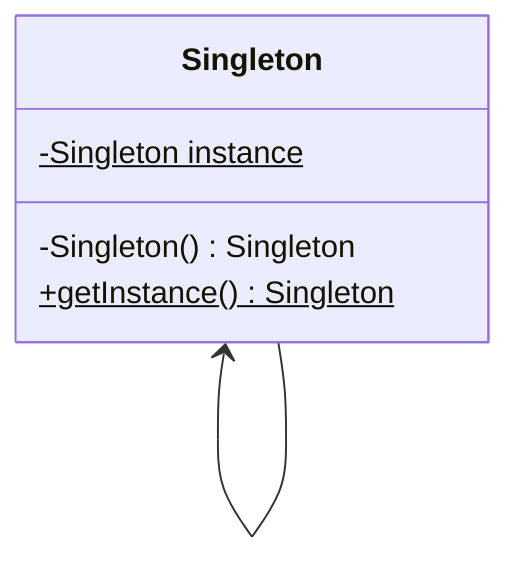

2. 静态内部类

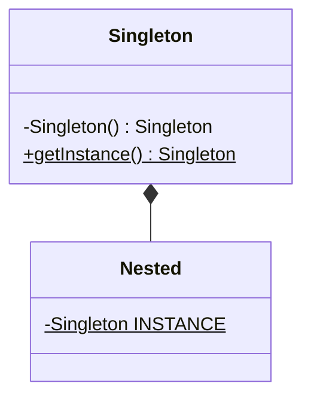

3. 枚举类

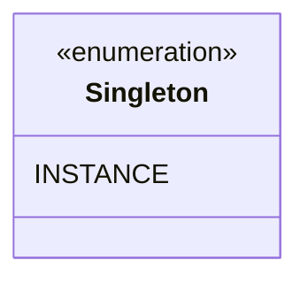

## 简单工厂（Simple Factory）

提供一个创建对象的通用接口，向用户屏蔽对象内部细节。

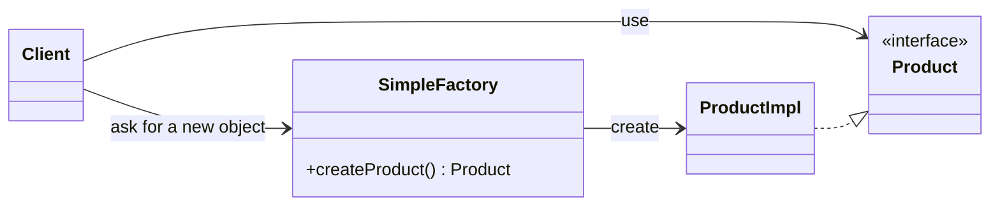

## 工厂方法（Factory Method）

提供一个创建对象的通用接口和对应接口实现类；将对象实例化操作推迟到子类。

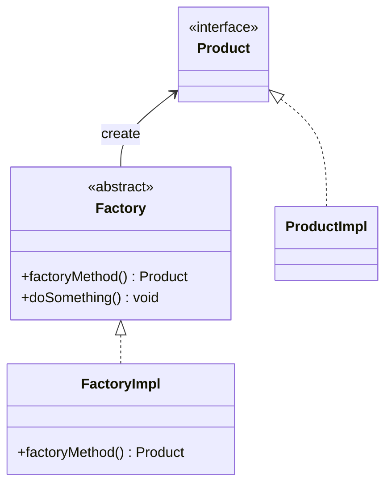

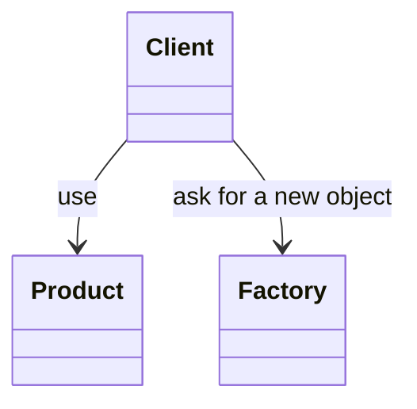

## 抽象工厂（Abstract Factory）

提供一个用于创建一系列相关类对象的接口，无需指定具体实现类。

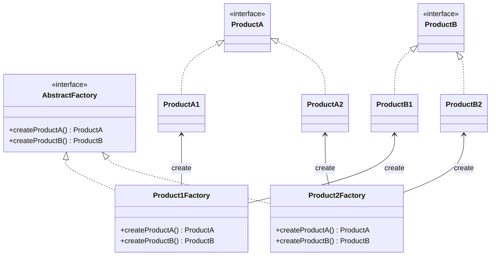

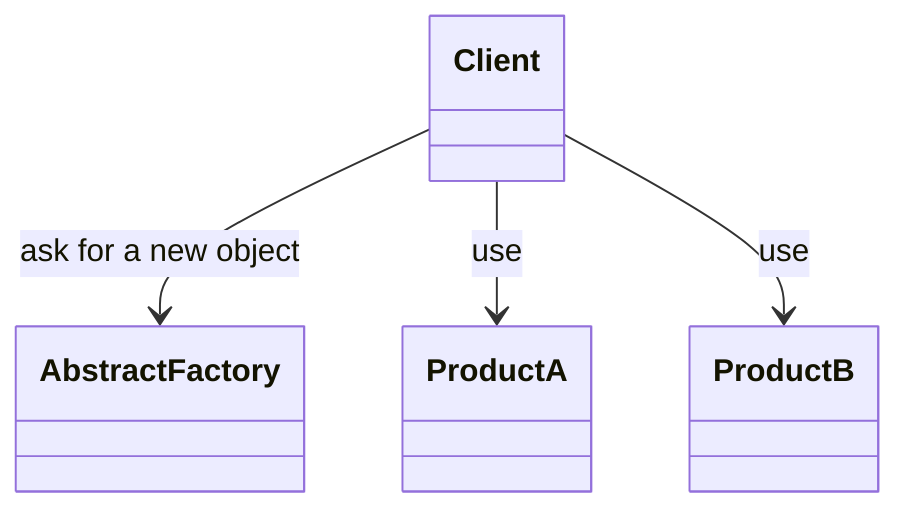

## 生成器（Builder）

提供一个用于构建对象的实例，该实例封装一个复杂对象的构建过程，使其构建与表示分离。

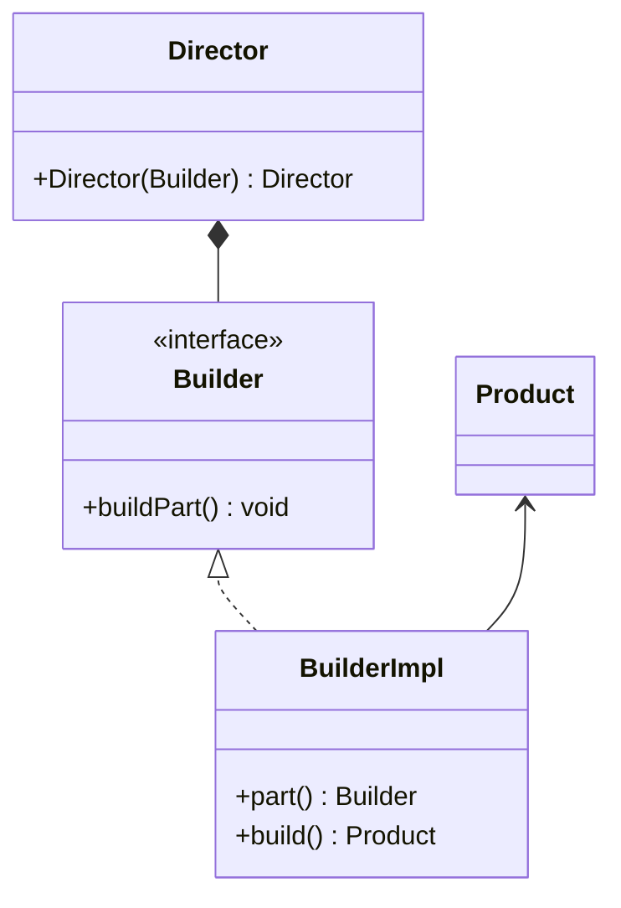

## 原型（Prototype）

以原型实例指定创建实例的类型，并通过复制该原型创建对象。

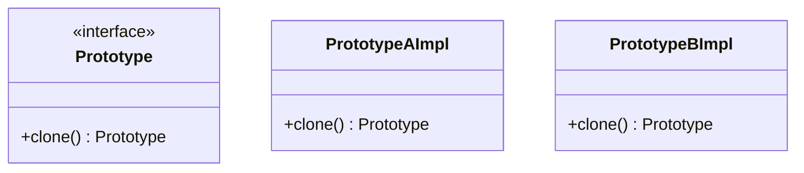

## 对象池（Object Pool）

重用或共享创建成本高的对象。

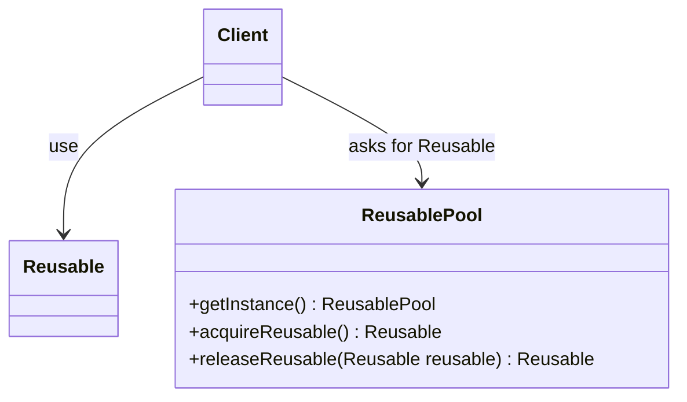

# 结构型（Structural Patterns）

## 适配器（Adapter）

## 桥接（Bridge）

## 组合（Composite）

## 装饰器（Decorator）

## 外观（Facade）

## 享元（Flyweight）

## 代理（Proxy）

# 行为型（Behavioral Patterns）

## 责任链（Chain of Responsibility）

## 命令（Command）

## 解释器（Interpreter）

## 迭代器（Iterator）

## 中介（Mediator）

## 备忘录（Memento）

## 观察者（Observer）

## 状态（State）

## 策略（Strategy）

## 模版方法（Template Method）

## 访问者（Visitor）

## 空对象（Null）
